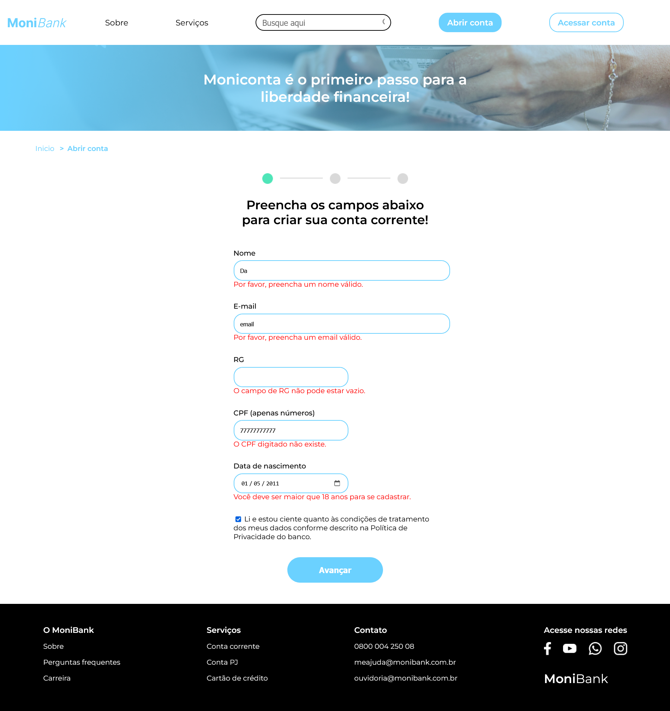
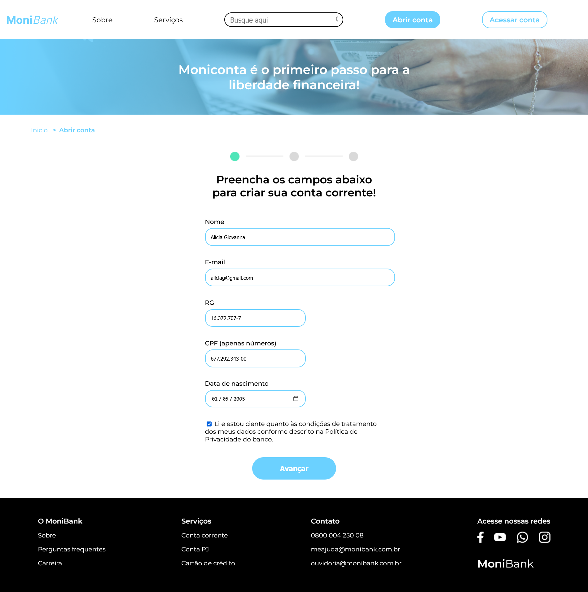
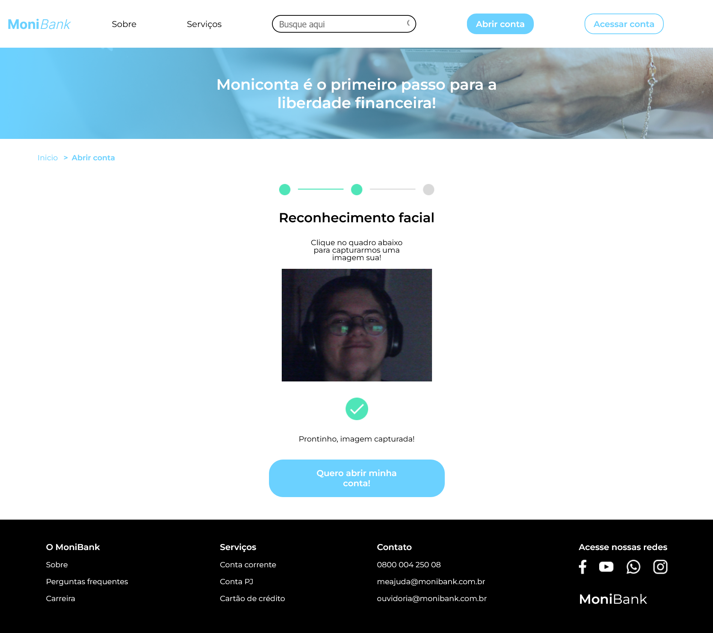

# MoniBank

 
 

Projeto desenvolvido durante o curso de validação de formulários no programa Desenvolve, projeto promovido pelo Grupo Boticário e a escola Alura. O objetivo foi validar os dados de cadastro de novos usuários do MoniBank, validando via formulário todas as informações, incluindo validação personalizada para idade e CPF.

Foi adicionado também um modo de captura de foto (sem lógica para a validação do reconhecimento facial, somente captura) e, ambos dados e foto, são armazenados em local storage.

### Tecnologias

## Vercel

### Prints

***Todos os dados usados neste teste são fictícios, gerados pelo 4Devs.***

